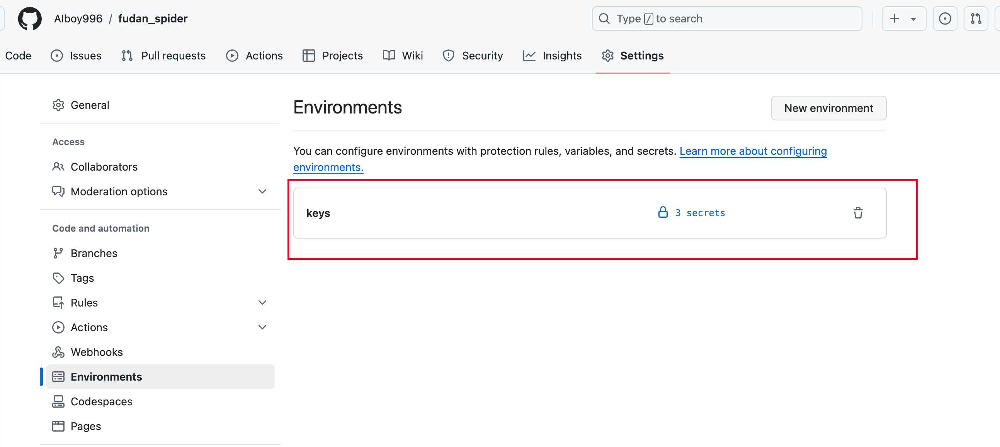
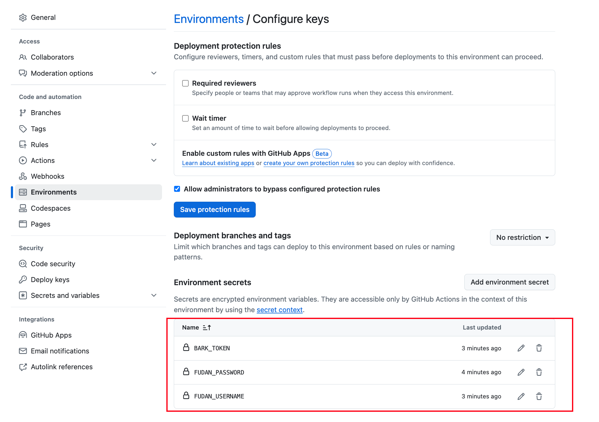

# fudan spider

- 查询脚本：Python
- 手机通知：基于[Bark](https://bark.day.app/#/)
- 每天自动运行：基于[GitHub actions](https://github.com/features/actions)

## 功能
定时查询：
- 宿舍电费余量
    - 低于30kwh触发Bark通知
- 一卡通余额
    - 低于20元触发Bark通知

Bark通知示例：

## 使用方法

1. Fork本仓库
2. 添加Environments【注意，Environments必须命名为`keys`】

3. 配置Secrets
- FUDAN_USERNAME: UIS学号
- FUDAN_PASSWORD: UIS密码
- BARK_TOKEN: bark通知的token

## TODO

- 增加更多定时查询内容
    - 绩点？
- 增加更多通知方式【暂时仅支持Bark，iOS可用】
    - 邮件？
    - 安卓端的app？

**欢迎PR**

